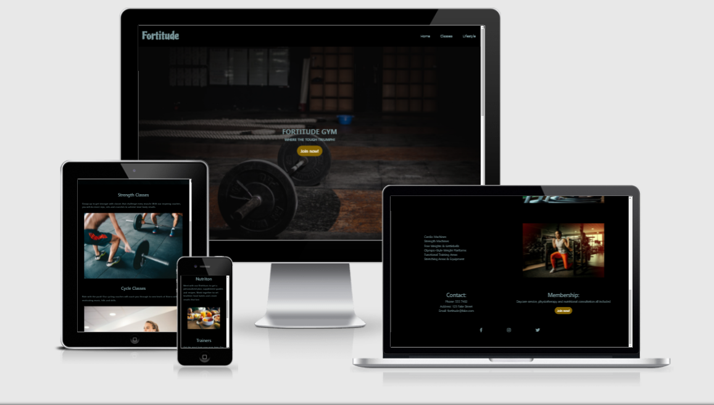

# Milestone Project 1

### Fortitude Gym

## Purpose:

Fortitude gym is fictional gym created using HTML and CSS for my first milestone project. It will provide users with information on the gym and it's services for existing and potential members.

## User Stories:

### As a user, I wish to be able to: 

Easily navigate the site to find what I need.

Find out what services are provided.

Find location and contact details.

See what's included in membership.

### As the site owner, I wish to:

Aquire new customers and provide existing customers with any relevant information.

## Structure:

All pages will consist of a navigation bar, a callout with a sign up button for membership deals and special offers and a footer with contact and membership details and links to social media.

### Wireframe mockups:

[Home Page](assets/wireframes/home.pdf)

[Classes](assets/wireframes/classes.pdf)

[Lifestyle](assets/wireframes/lifestyle.pdf)

## Features:

The navbar will bring users to their desired location.

The join now button will trigger a pop out modal prompting users to enter their details.

The social media links will all direct users to the associated website in a new window. 

## Technologies:

* Bootstrap 4 was used for layout, to reduce navbar to hamburger menu and for the modal popout. https://getbootstrap.com/

* Google fonts was used for the fonts used on site(Piedra an Roboto). https://fonts.google.com/

* Font Awesome was used for the social media icon links and also for the hamburger menu icon on mobile. https://fontawesome.com/

## Testing:

* The nav links bring you to the desired location. No dead links, modals work as expected.

* The join now button triggers the modal - appropriate inputs are required.

* The social media links bring you to the corresponding page in a new tab.

#### Bug fixes

* Not many interesting/noteworthy bugs to speak of, more time experimenting with styling

* Occasional contrast issues found with dev tools but easy fix with lighter shades of same color

#### User stoty Testing

**Easily navigate the site to find what I need**

* Clearly marked navigation links, contact information and membership details on footer of all pages.

* Site logo always navigates back to homepage

* Clear join button for any users interested in membership

**Find out what services are provided**

* information on equipment, classes, and extra services provide through their respective nav-links

**Find contact info and details**

* contact and membership details in footer along with join button for extra details and offers

## Deployment:

This project was developed in gitpod development environment, commited to Github using the built in function in the terminal.

To deploy to Github pages, the following steps were taken:

1. Log in to GitHub
2. From repositories list select [patricksingleton86/milestone-1-gym](https://github.com/patricksingleton86/milestone-1-gym)
3. From the menu items , select Settings
4. Scroll to Github pages section, select master branch in dropdown menu and click save
5. The link to the deployed website should now be displayed by the Github pages heading

### Deployed site

## Running project locally

1. Install [Gitpod browser extension](https://chrome.google.com/webstore/detail/gitpod-dev-environments-i/dodmmooeoklaejobgleioelladacbeki?hl=en) for Chrome
2. Log into Gitpod
3. Open the [repository](https://github.com/patricksingleton86/milestone-1-gym) from Github
4. Click the green Gitpod button above the repository
5. Project should now open in your own gitpod workspace

#### To run project in a differnt environment

1. Open [project repository](https://github.com/patricksingleton86/milestone-1-gym)
2. Click the code dropdown beside the gittpod link
3. Copy the clone url
4. In your own IDE terminal, cheange the current eork environment to the location you wish the cloned directory to be made
5. Type 'git clone' and paste the previously copied url

## Credits:

* 

### Content:
Got text for classes and personal trainers from 24 hour fittness - https://www.24hourfitness.com/classes/studio/ https://www.24hourfitness.com/training/ 

### Photos:

Leon Ardho - https://www.pexels.com/photo/barbell-on-the-floor-1552252/

cottonbro - https://www.pexels.com/photo/man-in-black-t-shirt-and-black-pants-playing-skateboard-4761352/

Leon Ardho - https://www.pexels.com/photo/man-and-woman-holding-battle-ropes-1552242/

Andrea Piacquadio - https://www.pexels.com/photo/serious-sportsman-training-on-exercise-machine-in-modern-gym-3838937/

Jonathan Borba - https://www.pexels.com/photo/woman-kneeling-with-barbel-on-shoulders-3076514/

William Choquette - https://www.pexels.com/photo/an-on-treadmill-1954524/

Victor Freitas - https://www.pexels.com/photo/man-wearing-black-shorts-lifting-heavy-barbells-841135/

Andrea Piacquadio - https://www.pexels.com/photo/photo-of-woman-using-earphones-3757954/

Ketut Subiyanto - https://www.pexels.com/photo/photo-of-man-doing-push-ups-using-yellow-kettlebell-4720251/

Andrea Piacquadio - https://www.pexels.com/photo/women-doing-yoga-class-on-pink-yoga-mat-3775593/

Pixabay - https://www.pexels.com/photo/adult-athlete-body-bodybuilding-414029/

Burst - https://www.pexels.com/photo/shallow-focus-photo-of-spoon-373941/